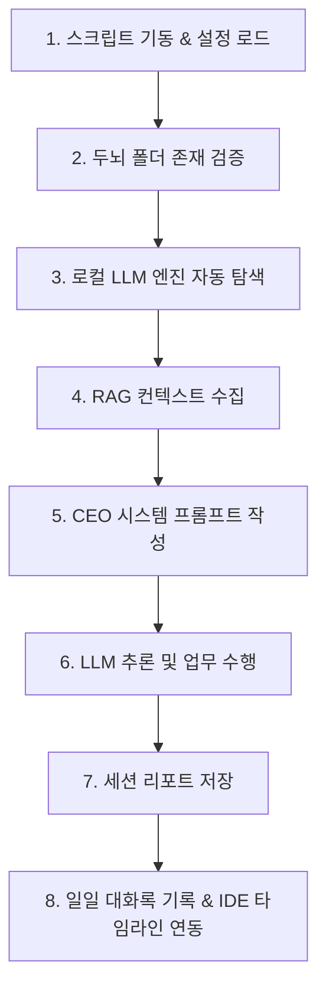

# 🌙 Connect AI Lab: 자율 사이클(Autocycle) 라이프사이클 상세 분석

이 문서는 IDE 외부에서 24시간 독립적으로 작동하며 AI 1인 기업가들의 비즈니스를 자동으로 진전시키는 `scripts/cycle.js` 스크립트의 작동 단계를 시작부터 끝까지 정밀하게 분석합니다.

---

## 📌 개요 (Overview)

`cycle.js`는 **Connect AI**의 핵심 자율 구동 백그라운드 엔진입니다. VS Code 익스텐션 수명 주기(Lifecycle)와 완전히 분리되어 독립적으로 동작하므로, 개발자가 **IDE를 종료하거나 PC를 자리를 비운 시간에도 백그라운드에서 끊임없이 지식 탐색, 마케팅 전략 수립, 카피라이팅, 개발 계획 정립 등의 업무를 진행**하고 그 결과를 제2의 두뇌(Second Brain)에 누적합니다.

---

## ⚙️ 1단계: 환경 설정 및 변수 로드 (Configuration Initialization)
스크립트가 실행되면 가장 먼저 구동 환경에 필요한 설정 값들을 프로세스의 환경 변수(`process.env`)로부터 읽어옵니다. 값이 지정되지 않은 경우 지능형 디폴트값을 매핑하여 실행 안정성을 확보합니다.

*   **`BRAIN_DIR`** (두뇌 디렉토리): `process.env.BRAIN_DIR`을 우선하며, 지정되지 않은 경우 사용자 홈 디렉토리 하위의 `.connect-ai-brain` 경로로 자동 바인딩됩니다. (`~/` 기호는 OS 홈 디렉토리 절대 경로로 변환됩니다.)
*   **`OLLAMA_URL`** (기본값: `http://127.0.0.1:11434`): 로컬에서 구동되는 Ollama 엔진 주소입니다.
*   **`LMSTUDIO_URL`** (기본값: `http://127.0.0.1:1234`): 로컬에서 구동되는 LM Studio 엔진 주소입니다.
*   **`MODEL`** (기본값: `gemma4:e2b`): 추론 및 업무 수행에 사용될 기본 로컬 LLM 모델명입니다.
*   **`TIMEOUT_MS`** (기본값: `180000` / 3분): 로컬 모델 로딩 및 응답 생성 대기 시간의 상한선입니다.

---

## 📁 2단계: 두뇌 폴더 존재 검증 (Brain Folder Validation)
실행 중인 가상 회사 데이터의 무결성을 검증하는 단계입니다.
*   `BRAIN_DIR` 하위의 **`_shared`** 디렉토리가 존재하는지 검사합니다.
*   만약 이 폴더가 없다면, 사용자가 VS Code 상에서 익스텐션을 최소 1회 실행하여 기본 구조를 생성하지 않은 것으로 판단하고, 안내 메시지와 함께 프로세스를 종료(`process.exit(1)`)합니다.

---

## 🔍 3단계: 로컬 LLM 엔진 자동 탐색 (Local LLM Engine Detection)
오프라인 자율 작동을 실현하기 위해 실행 장치에 켜져 있는 로컬 LLM 서버를 능동적으로 파악합니다.
*   **Ollama 검사**: `OLLAMA_URL/api/tags` 경로로 타임아웃 1.5초 제한의 GET 요청을 보냅니다. 성공 시 엔진 종류를 `ollama`로 설정합니다.
*   **LM Studio 검사**: Ollama 탐색이 실패하면, `LMSTUDIO_URL/v1/models` 경로로 타임아웃 1.5초 제한의 GET 요청을 시도합니다. 성공 시 엔진 종류를 `lmstudio`로 설정합니다.
*   두 엔진 모두 탐색에 실패할 경우, 자율 사이클을 진행할 수 없으므로 `No local LLM detected.` 에러를 발생시키고 실행을 중단합니다.

---

## 🧠 4단계: RAG 컨텍스트 수집 (RAG Context Gathering)
AI CEO 에이전트가 회사의 상황을 객관적으로 인지하고 일관성 있게 판단할 수 있도록, 두뇌 공유 데이터베이스(`_shared` 폴더) 내의 지식을 실시간으로 수집하고 글자 수 상한선을 두어 프롬프트 토큰 오버플로우를 예방합니다.

1.  **회사 정체성 로드 (`identity.md`)**: 회사의 비전, 타겟 시장, 페르소나 정보를 최대 **1,500자**까지 잘라서 메모리에 로드합니다.
2.  **공동 목표 로드 (`goals.md`)**: 현재 비즈니스의 우선순위 목표와 마일스톤을 최대 **2,000자**까지 잘라서 로드합니다.
3.  **최근 의사결정 로드 (`decisions.md`)**: 에이전트들과 CEO가 과거에 내린 의사결정 및 작업 이력을 추적하기 위해 최신 로그 부분만 뒤에서부터 **2,000자**를 잘라서 로드합니다.

---

## 📝 5단계: CEO 시스템 프롬프트 작성 (System Prompt Construction)
가상 컨텍스트 정보를 취합하여 AI 에이전트를 **"자율 운영되는 1인 AI 기업의 CEO"** 역할로 완전히 동기화시키는 시스템 프롬프트(`sysPrompt`)를 자동 조립합니다.

*   수집한 회사 정체성(`identity`), 공동 목표(`goals`), 최근 의사결정 이력(`decisions`)을 동적으로 주입합니다.
*   AI CEO에게 **"지금 가장 가치 있는 작업 단 1개만을 선별하여 결과물을 직접 산출할 것"**을 지시합니다.
*   산출물의 포맷을 고정하고 타임라인 뷰어에 최적화된 마크다운 구조로 한정합니다:
    1.  `# 🌙 자율 사이클 — [날짜] [시간]` (대형 헤더)
    2.  `## 선택한 작업` (작업 선정의 당위성 및 전략 분석)
    3.  `## 실행 결과` (실제 기획서, 광고 문구, 비즈니스 아이디어 등 즉시 사용 가능한 실무 결과물)
    4.  `## 다음 사이클 추천` (이어질 다음 태스크 제안)

---

## 🤖 6단계: LLM 추론 및 업무 수행 (LLM Inference & Execution)
감지된 로컬 엔진 규격(Ollama API 혹은 LM Studio OpenAI-Compatible API)에 맞추어 API 페이로드를 전달하여 가상 업무를 수행합니다.

*   **LM Studio 호출**: `/v1/chat/completions` API를 사용하며, Chat Completion 규격으로 `system` 및 `user` 역할을 전송합니다. (`temperature: 0.6`으로 창의성과 현실성을 타협합니다.)
*   **Ollama 호출**: `/api/chat` API를 사용하며, 컨텍스트 윈도우 크기를 `num_ctx: 8192`로 설정해 긴 문서 처리 역량을 최대화합니다.
*   LLM 연동 실패 혹은 빈 응답(Empty Response)이 반환될 경우 즉시 오류를 발생시키고 안전하게 종료합니다.

---

## 💾 7단계: 세션 리포트 저장 (Session Report Saving)
생성된 고부가가치 비즈니스 리포트를 물리 파일로 영구 저장합니다.
*   `BRAIN_DIR/sessions/auto-<year-month-day-hour-minute>/` 형식의 고유 시간 기반 세션 디렉토리를 생성합니다.
*   LLM이 생성한 전체 마크다운 산출물을 **`_report.md`** 파일로 신규 저장하여 자율적 업무 결과를 기록으로 남깁니다.

---

## 📜 8단계: 일일 대화록 기록 & IDE 타임라인 연동 (Daily Conversation Logging)
자율 사이클의 작업 내역이 사용자의 VS Code IDE 사이드바에 나타나는 타임라인에 실시간 연동될 수 있도록 포맷을 매핑하여 추가합니다.

*   `BRAIN_DIR/00_Raw/conversations/YYYY-MM-DD.md` 경로의 오늘 자 일일 대화록 파일을 확인합니다.
*   오늘 작성된 파일이 없다면, 파일의 초기 헤더(`# 📜 YYYY-MM-DD 회사 대화록`)를 자동 빌드 및 생성합니다.
*   대화록 파일 하단에 `## [HH:MM:SS] 🌙 자율 사이클 · IDE 외부` 형식의 구분 블록을 덧붙인 뒤(Append), AI CEO의 최종 산출물 리포트를 누적 기록합니다.
*   이 처리를 통해 사용자가 나중에 IDE를 켰을 때 **"내가 자리를 비운 사이에 AI CEO가 어떤 업무를 처리해 두었는지"** 타임라인을 통해 시각적으로 한눈에 확인할 수 있습니다.

---

## ⏰ 9단계: 자동화 스케줄링 예시 (Scheduling & Production Setup)
`cycle.js`는 파일 하단에 다양한 OS 환경에서 이 라이프사이클을 주기적(예: 30분 단위)으로 무한 자동 반복 실행하기 위한 표준 가이드를 내장하고 있습니다.

1.  **macOS (launchd)**: `~/Library/LaunchAgents/com.connectai.cycle.plist` 파일을 배치하고, `StartInterval`을 `1800`초로 주어 `launchctl load`를 통해 자율적으로 백그라운드 상주 데몬 실행을 제공합니다.
2.  **Linux (cron)**: `crontab -e` 명령을 사용하여 `*/30 * * * *` 주기로 `node cycle.js`가 매 30분마다 작동하고 출력을 로그 파일에 자동 기록하도록 연결합니다.
3.  **Windows (Task Scheduler)**: 작업 스케줄러를 등록하여 30분 간격으로 `node.exe`를 통해 해당 자율 루프 파일이 가동되도록 안내합니다.
